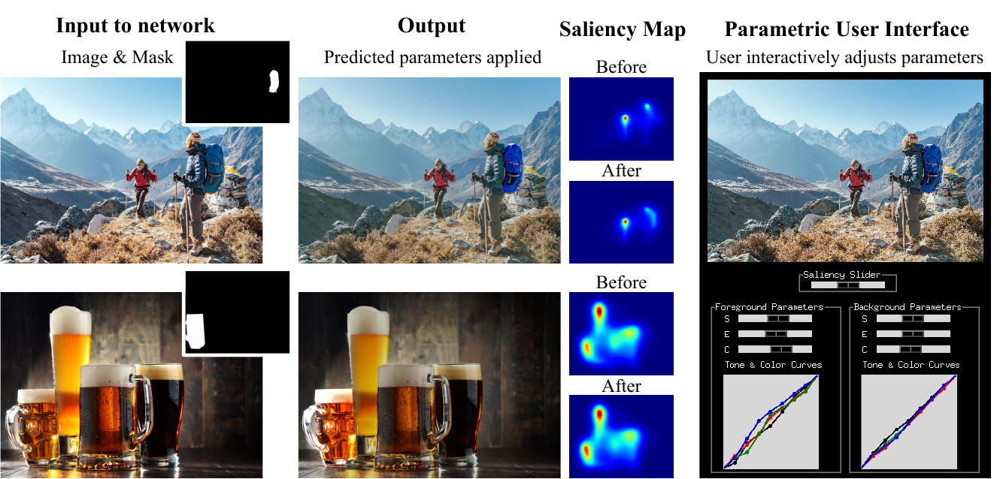

# Look here! A learning based approach to redirect visual attention
This is the official code for the paper [Look here! A learning based approach to redirect visual attention](https://alamimejjati.github.io/GazeShiftNet), to appear in ECCV 2020.

### Environment
The pre-trained saliency model assumes the followed package versions: 

python 3.5 

tensorflow 1.13.1

keras 2.2.4

To avoid version mismatches, you could create a new environment via:

    conda create --name <env> --file mdsem-env.txt
    
Once the environment created, install the rest of the packages via: 

    pip install -r pip_requirements.txt

### Downloads
1- Download COCO dataset if not already available. 

2- Download the saliency model and extract the folder in your working directory. The model can be downloaded from: https://drive.google.com/file/d/1ILq7bm8D9dOnqP-kDr218703QXGaDmMG/view?usp=sharing
 
3- You can download pre-trained models for all training settings mentioned below via the google drive link:  https://drive.google.com/drive/folders/1TT27mR-Wmf3mhHfbPGQluQZ30ukl_yp1?usp=sharing

### Data preparation
Start by creating the CoCoClutter dataset by replacing with your paths in th commands below. Here it is assumed that COCO has been placed in `./datasets/COCO`.

1- Create training data:

    python create_dataset.py --path ./datasets/COCO --salmodelpath ./saliency-shared-dir/mdsem_model_LSUN_Oct2019/mdsem_model_LSUN_full.h5

2- Create validation data:

    python create_dataset_val.py --path ./datasets/COCO --salmodelpath ./saliency-shared-dir/mdsem_model_LSUN_Oct2019/mdsem_model_LSUN_full.h5

These will create the folders `./datasets/CoCoClutter/increase/maskdir` and `./datasets/CoCoClutter/increase/maskdir_val` respectively.

### Training

    python main.py --data ./datasets/CoCoClutter/increase --path ./datasets/datasets/COCO --salmodelpath ./saliency-shared-dir/mdsem_model_LSUN_Oct2019/mdsem_model_LSUN_full.h5

Checkpoints will be saved in the parent directory `logs`. 
Intermediate results can be visualized using tensorboard. 
Test results are computed directly after the training and are saved in the same directory as the corresponding checkpoint files. 

### Inference
Inference from pre-trained models, can be done using the command below (Here we use assume that the checkpoint files are stored in `$checkpoint_dir`): 

    python main.py --data ./datasets --path /home/yam28/Documents/phdYoop/datasets/datasets/COCO --salmodelpath ./saliency-shared-dir/mdsem_model_LSUN_Oct2019/mdsem_model_LSUN_full.h5 --checkpoint_dir $checkpoint_dir --traintest 2 --batch_size 1 --dataloader CoCoLoader_rectangle_HR

If you want to do inference on your own images. The best way is to use a frozen model. To do so, first freeze the model using: 

    python freeze_graph.py --model_dir $checkpoint_dir

The frozen graph is saved in the corresponding log directory under `frozen_model.pb`. 

You can then run inference. We provide an inference example script using the small example_data provided in the `datasets` folder: 

    python infer_HR.py --frozen_model $checkpoint_dir/frozen_model.pb

Images will be saved under results_from_frozen in the corresponding checkpoint directory. 

Using the frozen model, one can perfrom interactive image editing. An example is provided in `GUI.py':

    python GUI.py --frozen_model $checkpoint_dir/frozen_model.pb

Important note: to use the GUI, please install the user interface library PySimpleGUI. You might need to switch to a python version >3.5 for this to work.  
### Extensions 

##### Increase user attention in a stochastic manner (Multi-Style):

You can train the model to produce diverse outputs from the same image and mask by running the command below:

    python main.py --data ./datasets/CoCoClutter/increase --path ./datasets/COCO --salmodelpath ./saliency-shared-dir/mdsem_model_LSUN_Oct2019/mdsem_model_LSUN_full.h5 --trainer adv_increase_multistyle_sftmx --G increase_multistyle 
 
Inference will be done automatically after training. However you can run inference from a pre-trained model in a similar manner as previously:
 
    python main.py --data ./datasets/CoCoClutter/increase --path ./datasets/COCO --salmodelpath ./saliency-shared-dir/mdsem_model_LSUN_Oct2019/mdsem_model_LSUN_full.h5 --trainer adv_increase_multistyle_sftmx --G increase_multistyle --checkpoint_dir $checkpoint_dir --traintest 2 --batch_size 1 --dataloader CoCoLoader_rectangle_HR

##### Increase and Decrease user attention simultaneously: 

You can train the model to shift the attention towards and away from the object. To do this, follow the steps below: 

1- Create the dataset for this task (This is different from CoCoClutter):

Training data:

    python create_dataset_incdec.py --path ./datasets/COCO --salmodelpath ./saliency-shared-dir/mdsem_model_LSUN_Oct2019/mdsem_model_LSUN_full.h5
Validation data:    

    python create_dataset_incdec_val.py --path ./datasets/COCO --salmodelpath ./saliency-shared-dir/mdsem_model_LSUN_Oct2019/mdsem_model_LSUN_full.h5

These will create the folders `./datasets/CoCoClutter/incdec/maskdir` and `./datasets/CoCoClutter/incdec/maskdir_val` respectively.

2- Train the model:

    python main.py --data ./datasets/CoCoClutter/incdec --path ./datasets/COCO --salmodelpath ./saliency-shared-dir/mdsem_model_LSUN_Oct2019/mdsem_model_LSUN_full.h5 --G incdec --trainer adv_incdec_sftmx --batch_size 2 --LAMBDAsal 20000 --nb_its 300000

 Inference will be done automatically after training. However you can run inference using a pre-trained model in a similar manner as previously:

    python main.py --data ./datasets/CoCoClutter/incdec --path ./datasets/COCO --salmodelpath ./saliency-shared-dir/mdsem_model_LSUN_Oct2019/mdsem_model_LSUN_full.h5 --G incdec --trainer adv_incdec_sftmx --checkpoint_dir $checkpoint_dir --traintest 2 --batch_size 1 --dataloader CoCoLoader_rectangle_HR

### Pre-trained models

You can download pre-trained models for all training settings via the google drive link:  https://drive.google.com/drive/folders/1TT27mR-Wmf3mhHfbPGQluQZ30ukl_yp1?usp=sharing
